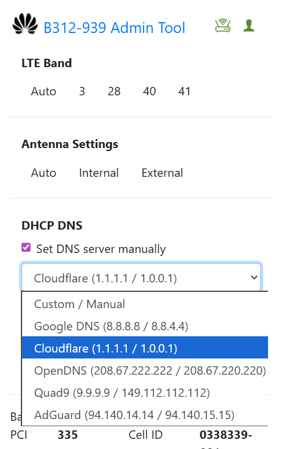
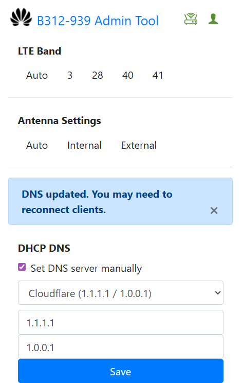

# B312-939 Admin Tool

  
  &nbsp;
  

A Chrome Extension that lets users manually set the **LTE band**, **antenna settings**, and now **custom DNS** of the Huawei **B312-939** modem **without admin access**.

Originally created by **Chris Laconsay**.  
Extended and improved by **RDevz PH**.

---

> ⚠️ **Project Status (IMPORTANT)**  
>  
> This is the **final version** of the B312-939 Admin Tool.  
> **No future updates, bug fixes, or new features** will be released.  
>  
> The project is considered **complete**, stable for its purpose,  
> and will remain available **as-is**.

---

## 📌 New in This Update (by RDevz PH)

### ✅ Added DHCP / DNS Configuration
You can now set **custom DNS servers** directly through the tool.

- Full support for `/api/dhcp/settings` updating  
- Auto-detects current DNS  
- Includes DNS provider presets:
  - **Google DNS** – 8.8.8.8 / 8.8.4.4
  - **Cloudflare** – 1.1.1.1 / 1.0.0.1
  - **OpenDNS** – 208.67.222.222 / 208.67.220.220
  - **Quad9** – 9.9.9.9 / 149.112.112.112
  - **AdGuard DNS** – 94.140.14.14 / 94.140.15.15
- Manual DNS input supported
- DNS UI section only appears when the API is available

### 🛠 Additional Enhancements
- Added a full DHCP/DNS UI section  
- Automatic token retrieval for DNS updates  
- Streamlined form actions & alert handling  
- Clean integration with existing band and antenna features

---

## 📺 Installation

Follow the original installation video:

🔗 https://www.youtube.com/watch?v=buFtv9XOOd8

## 👀 Preview

🔗 https://www.youtube.com/watch?v=buFtv9XOOd8

---

## 📘 Paano Gamitin

1. Sundan ang video ng installation para ma-install ang tool.  
2. Login sa router (`192.168.254.254`) gamit ang default **user** account.  
3. Siguraduhing **green** ang icon ng *Router* at *User* para malaman na connected ka.  
4. **Band Locking**
   - Subukan ang bawat band isa-isa  
   - Mag-speed test bawat palit  
   - Piliin ang pinakamalakas at pinakastable  
5. **DNS Configuration**
   - Pumili ng DNS preset *o* maglagay ng custom DNS  
   - Click **Save**  
   - Reconnect devices if needed

---

## ⚠️ Paalala

Hindi po ako nagbibigay ng **FREE ADMIN ACCESS**.  
Ang tool na ito ay para lang sa **band selection**, **antenna control**, at **DNS configuration** gamit ang **default Globe user access**.

**Important reminders:**

- Normal lang na mawala ang signal kapag nagpapalit ng band  
- Nangyayari rin ito sa legit admin interface  
- Madalas ang Globe maintenance kaya may pansamantalang signal loss  
- Minsan bumabalik agad, minsan kailangan ng modem reboot/reset  
- Gamitin lamang ang tool kung naiintindihan mo ang risk  
- Basahin ang [`LICENSE`](LICENSE) bago gamitin.

---

## 👨‍💻 Credits

### 🟦 Original Author  
**Chris Laconsay**  
Creator of the original B312 Band & Antenna Tool  
Source: https://github.com/arielmagbanua/adminer

### 🟩 DNS + Feature Enhancements  
**RDevz PH**  
Added DHCP/DNS feature, presets, API logic, UI updates, and improvements

---
